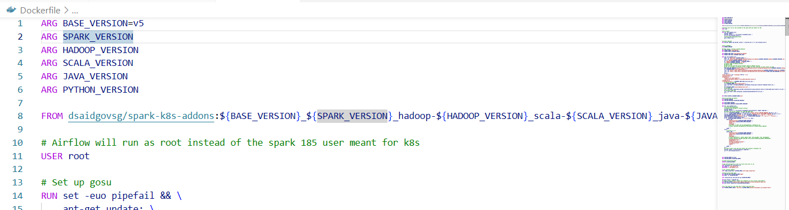
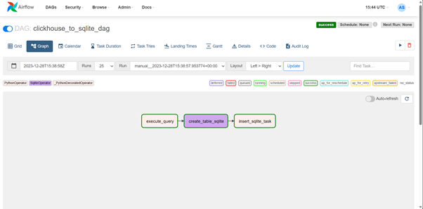
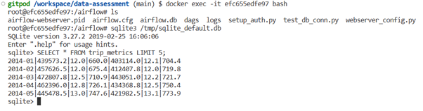

# README: Airflow Pipeline for Data Transfer from Clickhouse to SQLite

This README provides a comprehensive guide on setting up an Apache Airflow pipeline to transfer data from a Clickhouse database to an SQLite database. The process involves configuring a Docker environment, setting up Airflow, and executing a DAG (Directed Acyclic Graph) to manage the data transfer.

## Prerequisites

- Docker and Docker Compose installed
- Basic knowledge of Docker, Airflow, and SQL databases

## Step 1: Docker Environment Setup

### Dockerfile

Create a `Dockerfile` to specify the environment for Airflow. This file includes instructions for installing necessary packages and dependencies.



### docker-compose.yml

Create a `docker-compose.yml` file to define and run the multi-container Docker applications. This includes Airflow, Clickhouse, and Jupyter-Spark services.


## Step 2: Building and Running the Docker Containers

Build the Docker image and run the containers using the following commands:

```bash
docker-compose build
docker-compose up
```

## Step 3: Accessing Apache Airflow

After starting the containers, Airflow will be available at `http://localhost:8080`. Use the default login credentials (if not changed) to access the Airflow web UI.

## Step 4: Triggering the DAG

In the Airflow UI, navigate to the DAGs tab, find your DAG for transferring data from Clickhouse to SQLite, and trigger it manually. Monitor the DAG’s progress and ensure it completes successfully.



## Step 5: Confirming Data Transfer

To confirm the data transfer, use shell scripting to access the SQLite database and query the data.



```bash
# Access the SQLite Database
sqlite3 /path/to/your/sqlite.db

# Run a SQL query to check the transferred data
SELECT * FROM your_table;
```

## Conclusion

This README outlines the steps to set up an Airflow pipeline for data transfer from Clickhouse to SQLite using Docker. It covers the setup of Docker environment, Airflow configuration, and the process to initiate and monitor the data transfer. For detailed customization and advanced configurations, refer to the official Airflow documentation and Docker guides.